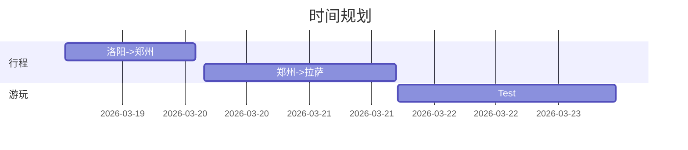

# 青春没有售价 硬座直达拉萨！

世界那么大，我想去看看。趁年轻出发去一次拉萨，去雪域高原感受神秘的藏文化纯净湛蓝的天空雄奇壮美的神山圣湖神秘而虔诚的宗教信仰以及曼妙生花的异域风情，踏上那块陌生而神奇的土地，沿着朝圣者的足迹走入那古老而遥远的传说。

```mermaid
gantt

title 时间规划

dateFormat MM-DD HH:mm

section 行程

    洛阳->郑州 : 03-19 01:00, 03-20 02:00
    郑州->拉萨 : 03-20 03:46, 03-21 16:46

section 游玩

    Test : 03-21 17:00, 03-23 11:00
```